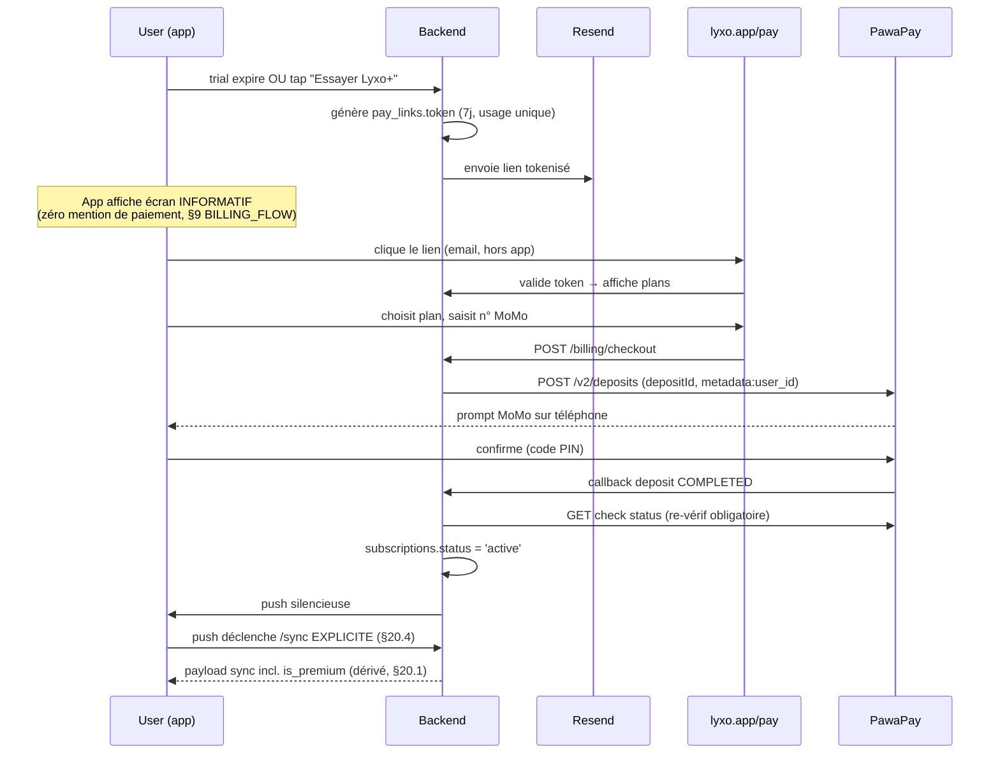

# ARCHITECTURE.md — LYXO · High-Level Design
# Version : 1.0 — fin Juillet 2026
# Rôle : le COMMENT structurel. Ce document existe pour qu'un agent IA
# (ou un futur toi) ne "propose helpfully" jamais un autre framework,
# une autre base de données, ou un autre prestataire de paiement en
# cours de route. Toute décision ici est FERMÉE (voir CLAUDE_LYXO_V3
# §18-20 pour le détail et la justification complète de chacune).

---

## 1. SYSTEM OVERVIEW DIAGRAM

```mermaid
flowchart TB
    subgraph Client["📱 APP MOBILE (React Native + Expo)"]
        UI["UI Layer<br/>NativeWind v4 + expo-router<br/>(palette Braise)"]
        WDB["WatermelonDB<br/>(SQLite local, offline-first)"]
        RCSdk["RevenueCat SDK<br/>(voie IAP internationale)"]
        UI --> WDB
        UI --> RCSdk
    end

    subgraph Backend["☁️ BACKEND (Node/Express sur Render)"]
        API["API REST<br/>/sync · /billing/* · /auth/*"]
        SyncEngine["Sync Engine<br/>pull/push WatermelonDB protocol<br/>pagination + soft-delete"]
        Webhooks["Webhook Handlers<br/>PawaPay · RevenueCat"]
        Cron["Cron Jobs<br/>purge J+90/J+30 · notif J75<br/>trial reminders J12/J14/J21"]
        API --> SyncEngine
        API --> Webhooks
    end

    subgraph Data["🗄️ SUPABASE (Postgres managé)"]
        PG[("PostgreSQL<br/>+ Row Level Security")]
        Auth["Supabase Auth<br/>email/Google/Apple"]
        Storage["Supabase Storage<br/>stories photos (purge 24h)"]
        MatView["Vue matérialisée<br/>trending (pas de Redis < 10k DAU)"]
    end

    subgraph External["🌍 SERVICES EXTERNES"]
        PawaPay["PawaPay API v2<br/>deposits + payouts<br/>(Mobile Money Afrique)"]
        GooglePlay["Google Play Billing<br/>(Android international)"]
        AppleIAP["Apple StoreKit<br/>(iOS)"]
        Resend["Resend<br/>emails transactionnels"]
        ExerciseDB["ExerciseDB Pro<br/>200 exercices + GIFs"]
        Sentry["Sentry<br/>crash/error tracking"]
        PostHog["PostHog (EU)<br/>analytics produit"]
        ExpoPush["Expo Push<br/>notifications"]
    end

    UI <-->|"pull/push sync<br/>(WiFi/data, retry)"| API
    RCSdk <-->|"achats + reçus"| GooglePlay
    RCSdk <-->|"achats + reçus"| AppleIAP
    RCSdk -->|"webhook: renewal/cancel"| Webhooks

    API <-->|"SQL via Prisma"| PG
    API -->|"vérifie JWT"| Auth
    API -->|"upload/purge"| Storage
    API -->|"lit"| MatView
    API -->|"deposits/payouts"| PawaPay
    PawaPay -->|"webhook: deposit.completed"| Webhooks
    API -->|"envoie"| Resend
    API -->|"log erreurs"| Sentry
    API -->|"events funnel"| PostHog
    API -->|"push notif"| ExpoPush
    Client -.->|"cache GIFs (à la demande)"| ExerciseDB

    style Client fill:#151312,stroke:#C73E3A,color:#F5F1EC
    style Backend fill:#151312,stroke:#3A3F47,color:#F5F1EC
    style Data fill:#151312,stroke:#3A3F47,color:#F5F1EC
    style External fill:#0B0A0A,stroke:#2C2826,color:#8E8781
```



### Flux "paiement Afrique" (le plus important, hors de l'app)



---

## 2. MAJOR COMPONENTS — rôle, propriétaire, communication

| Composant | Rôle | Communique avec | Protocole |
|---|---|---|---|
| **App mobile** (RN/Expo) | UI, logique locale, cache offline | Backend, RevenueCat SDK, ExerciseDB (cache) | HTTPS REST, SDK natif |
| **WatermelonDB** | Base locale SQLite, source de vérité OFFLINE | App (lecture/écriture immédiate), Backend (sync) | Protocole pull/push WatermelonDB |
| **Backend API** (Node/Express) | Logique métier, orchestration, seule source de vérité EN LIGNE | Supabase, PawaPay, RevenueCat, Resend, Sentry, PostHog, Expo Push | REST, SQL (Prisma), webhooks |
| **Supabase Postgres** | Persistance, RLS (autorisation au niveau ligne) | Backend uniquement (jamais l'app directement pour l'écriture sensible) | SQL via Prisma |
| **Supabase Auth** | Identité, JWT | App (login), Backend (vérification JWT) | OAuth2/JWT |
| **Supabase Storage** | Fichiers (photos stories) | Backend (upload/purge), App (lecture directe via URL signée) | S3-compatible |
| **PawaPay** | Encaissement + payout Mobile Money (Afrique) | Backend uniquement (jamais l'app — zéro SDK côté client) | REST + webhooks signés |
| **RevenueCat** | Couche gestion IAP (Google Play + Apple) | App (SDK), Backend (webhooks) | SDK + webhooks |
| **Resend** | Emails transactionnels (le SEUL endroit où le lien de paiement Afrique apparaît) | Backend | REST API |
| **Sentry** | Observabilité erreurs | App + Backend (SDK des deux côtés) | SDK |
| **PostHog** | Analytics produit (funnels, rétention) | Backend (events serveur), App (events client) — EU hosting | SDK |
| **Expo Push** | Notifications push | Backend (déclenche), App (reçoit) | Expo Push API |

### Principe d'autorité (qui a le dernier mot)
- **Statut premium** : Backend/Postgres. Jamais l'app, jamais RevenueCat seul (RevenueCat confirme, le backend décide — table `subscriptions`).
- **Données de séance en conflit** : WatermelonDB local gagne jusqu'à la sync ; au-delà, Last-Write-Wins silencieux côté serveur (Q12a).
- **Région de facturation** : décidée une fois au signup, modifiable seulement par un endpoint admin — jamais recalculée à la volée côté client.

---

## 3. TECH STACK DECISIONS — et pourquoi (verrouillé)

> Toute proposition de changement de brique ci-dessous doit d'abord
> justifier pourquoi la raison originale ne tient plus — pas juste
> "telle alternative est plus moderne/populaire".

| Brique | Choix | Pourquoi (raisonnement complet : CLAUDE.md §19.12 et alentours) |
|---|---|---|
| Framework mobile | **React Native + Expo** | WatermelonDB n'existe qu'en RN (socle offline-first) · vélocité solo sur stack déjà maîtrisé · Claude Code meilleur en React/TS. Flutter écarté malgré une perf brute légèrement supérieure sur bas de gamme (neutralisée par la discipline DoD). |
| Base locale offline | **WatermelonDB** | Seul protocole de sync éprouvé pour RN ; réinventer un protocole soi-même serait la pire catégorie de bug possible pour un solo dev. |
| Styling | **NativeWind v4** | Tailwind connu (AdsFacile/MboaTV), compilation build-time (pas de coût runtime), meilleure génération de code par Claude Code. Tamagui (universel web+native inutile ici), Unistyles (perf extrême invisible sur des cards de données), twrnc (parsing runtime) écartés. |
| Navigation | **expo-router** | Standard Expo actuel, file-based, basé sur react-navigation. |
| Icônes | **lucide-react-native** | Exclusif — cohérence visuelle, bien connu de Claude Code. |
| Backend | **Node/Express + TypeScript** | Écosystème JS unifié avec le frontend, Prisma dispo, hébergement Render simple. |
| ORM | **Prisma** | Types générés, migrations versionnées — mais SOURCE DE VÉRITÉ = les migrations SQL manuelles (BILLING_FLOW §3), Prisma s'aligne dessus (`db pull`), jamais l'inverse (§20.5). |
| Base de données | **Supabase (Postgres managé)** | Auth + DB + Storage + RLS + Realtime en un seul service, free tier généreux, aucune gestion serveur DB. |
| Cache/queue | **Aucun (pas de Redis)** | Interdit avant 10 000 DAU (§16.6) — vue matérialisée Postgres rafraîchie par cron suffit largement à ce stade. Complexité non justifiée. |
| Hébergement backend | **Render** | Simple, économique (free tier Phase 1, Starter dès les webhooks paiement — un cold start ne doit jamais perdre un webhook). |
| Paiement Afrique | **PawaPay** | API v2 moderne, idempotence native (depositId), metadata anti-fraude natif, ~1%+frais MNO, 20+ marchés (couvre le multi-pays Phase 3 sans réintégration). CinetPay puis NotchPay écartés successivement (PRICING §6). |
| Paiement international | **RevenueCat** | Couche unique au-dessus de Google Play Billing ET Apple StoreKit — reçus, entitlements, trial natif, restauration, gratuit sous 2 500$/mois. |
| Email transactionnel | **Resend** | MCP officiel disponible, simple, suffisant pour le volume attendu. |
| Erreurs/crash | **Sentry** | SDK RN + Node, standard, gratuit à cette échelle, mesure directement le critère "crash-free ≥ 99,5%". |
| Analytics | **PostHog (EU)** | Funnels/rétention pour les métriques de décision beta (J7), hébergement EU pour la conformité RGPD diaspora. Branché à la beta, pas avant (instrumenter des écrans qui changent chaque semaine = travail jeté). |
| Push | **Expo Push** | Gratuit, intégré au stack Expo, suffisant (pas de besoin FCM direct). |
| Exercices | **ExerciseDB Pro** | Licence commerciale déjà budgétée, 200 exercices + GIFs, licence archivée `/docs/licenses/`. |

---

## 4. DEPLOYMENT TARGET

```
┌─────────────────────────────────────────────────────────┐
│ LOCAL          Expo Dev Build (pas Expo Go — WatermelonDB│
│                natif l'exige) sur Pixel 8 + device        │
│                bas de gamme ≤ 3 Go RAM                    │
├─────────────────────────────────────────────────────────┤
│ STAGING        Supabase branch (DB séparée) + Render      │
│                preview + Play Console INTERNAL TESTING    │
│                track (10 coachs beta, install 1-tap)      │
├─────────────────────────────────────────────────────────┤
│ PRODUCTION     EAS Build → .aab signé (Play App Signing   │
│                activé dès le 1er upload) → Play Store     │
│                production track. iOS : App Store (Phase   │
│                ultérieure, après validation Android)       │
├─────────────────────────────────────────────────────────┤
│ HOTFIX         EAS Update (OTA) — JS uniquement. Toute     │
│                nouvelle lib native = nouveau .aab, jamais  │
│                d'OTA sur du code natif.                    │
├─────────────────────────────────────────────────────────┤
│ BACKEND        Render (Node/Express). Free tier Phase 1 ; │
│                Starter payant OBLIGATOIRE dès l'activation │
│                des webhooks PawaPay (cold start = webhook  │
│                perdu = paiement non crédité).              │
├─────────────────────────────────────────────────────────┤
│ DATABASE       Supabase Cloud (managé, pas de serveur DB  │
│                à gérer). Pas de Docker local en V1 —       │
│                migrations + types générés contre la        │
│                branche distante.                          │
└─────────────────────────────────────────────────────────┘
```

Aucun conteneur Docker en production ni en dev (ni l'app ni le backend
n'en ont besoin — tout est cloud-managé ou mobile). CI : GitHub Actions
(lint + typecheck + tests sur PR), builds EAS déclenchés manuellement
(quota gratuit limité, pas gaspillé sur chaque commit). CodeRabbit en
review automatique de chaque PR.

---

## 4bis. REGISTRE DES DEEP LINKS / APP LINKS (audit doc passe 6, fiche 21)

Toute URL `lyxo.app/*` cliquée doit ouvrir l'app (Android App Links,
`assetlinks.json` + intent-filter — §19.4, PAS Branch.io) avec fallback
web si l'app est absente. Registre UNIQUE — toute nouvelle route web
DOIT être ajoutée ici avant sa mise en prod (sinon : lien mort classique,
ex. un reset password qui atterrit sur le Play Store) :

| Pattern | Écran cible (app) | Fallback web | Auth du lien |
|---|---|---|---|
| `lyxo.app/invite/{code}` | Acceptation invitation coach (§19.4, Q21b) | Page web → Play Store | Code = auth (long, aléatoire) |
| `lyxo.app/pay/:token` | Web UNIQUEMENT — pas d'app link (PawaPay, hors app par conformité §9) | — (c'est déjà la cible finale) | Token = auth |
| `lyxo.app/reset/{token}` | `reset-password.tsx` (UI prompt 3quater) | Page web équivalente si app absente | Token Supabase = auth |

## 5. THIRD-PARTY INTEGRATIONS — récapitulatif des rôles

| Service | Ce qu'il fait | Ce qu'il NE fait PAS |
|---|---|---|
| **Supabase** | Auth, DB, RLS, Storage | Ne gère aucun paiement |
| **PawaPay** | Encaisse + reverse (V2) le Mobile Money africain | N'apparaît JAMAIS dans l'UI de l'app — uniquement sur la page web lyxo.app/pay et dans l'email |
| **RevenueCat** | Gère les abonnements IAP (Android intl + iOS) | Ne touche jamais les paiements Afrique — n'a aucune connaissance de PawaPay |
| **Resend** | Envoie les emails (dont le SEUL lien de paiement Afrique) | N'est pas un CRM, pas de séquences marketing complexes en V1 |
| **Sentry** | Erreurs/crashes | Pas d'analytics produit (c'est PostHog) |
| **PostHog** | Funnels, rétention, événements produit | Pas de session replay en V1 (trop lourd, trop intrusif) ; pas de feature flags utilisés (kill switch = table maison) |
| **Expo (EAS)** | Build, OTA update, dépendances compatibles SDK | Pas d'hébergement backend (c'est Render) |
| **ExerciseDB Pro** | Catalogue d'exercices + médias | Pas de recommandation IA d'exercices |
| **Google Play / Apple** | Distribution + IAP (via RevenueCat) | N'a jamais accès au flux Mobile Money (hors de leur portée légale actuelle — BILLING_FLOW §9bis) |

### Ce qui est explicitement HORS architecture (et pourquoi)
- **Redis/Upstash** — avant 10k DAU, non justifié (§16.6).
- **Docker en prod/dev** — tout est managé cloud ou mobile, aucun besoin.
- **Un second ORM ou une seconde base de données** — Prisma + Postgres suffisent, pas de polyglot persistence pour un MVP solo.
- **Microservices** — un seul backend Node/Express monolithique ; le split en services n'a de sens qu'à une échelle que LYXO n'a pas encore.
- **CDN vidéo** — non-goal produit (pas de contenu vidéo long, PROJECT_BRIEF non-goal 4).

---

*Documents liés : CLAUDE_LYXO_V3.md (règles et schémas SQL détaillés,
§15-20) · BILLING_FLOW.md (flux de paiement complet) · PRD.md (features
et edge cases) · IMPLEMENTATION_PLAN.md (séquencement et outillage).*
