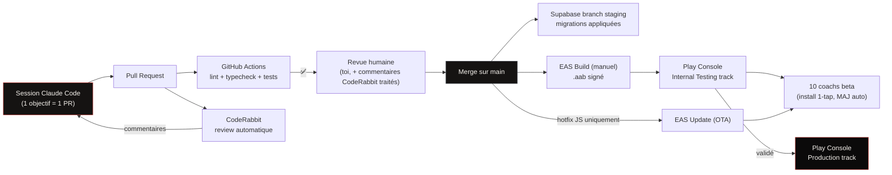

# CICD.md — LYXO · CI/CD Pipeline
# Version : 1.0 — fin Juillet 2026
# Rôle : le pipeline exact, de la PR ouverte jusqu'à la mise en prod.
# Consolide et détaille ce qui était dispersé dans IMPLEMENTATION_PLAN
# (Bloc A1/G) — ce document est la référence unique du "comment ça part
# en prod", pour ne pas réinventer un pipeline différent à chaque bloc.

---

## 0. VUE D'ENSEMBLE DU PIPELINE


```mermaid
flowchart LR
    Dev["Session Claude Code<br/>(1 objectif = 1 PR)"] --> PR["Pull Request"]
    PR --> CI["GitHub Actions<br/>lint + typecheck + tests"]
    PR --> CR["CodeRabbit<br/>review automatique"]
    CI -->|"✅"| Review["Revue humaine<br/>(toi, + commentaires CodeRabbit traités)"]
    CR -->|"commentaires"| Dev
    Review --> Merge["Merge sur main"]
    Merge --> StagingDB["Supabase branch staging<br/>migrations appliquées"]
    Merge --> EASBuild["EAS Build (manuel)<br/>.aab signé"]
    EASBuild --> Internal["Play Console<br/>Internal Testing track"]
    Internal --> Coaches["10 coachs beta<br/>(install 1-tap, MAJ auto)"]
    Internal -->|"validé"| Prod["Play Console<br/>Production track"]
    Merge -->|"hotfix JS uniquement"| OTA["EAS Update (OTA)"]
    OTA --> Coaches

    style Dev fill:#151312,stroke:#C73E3A,color:#F5F1EC
    style Merge fill:#151312,stroke:#3A3F47,color:#F5F1EC
    style Prod fill:#0B0A0A,stroke:#C73E3A,color:#F5F1EC
```

---

## 1. DÉCLENCHEURS ET ÉTAPES

### 1.1 À l'ouverture d'une Pull Request (GitHub Actions)
Workflow `.github/workflows/pr-checks.yml`, exécuté sur chaque PR vers
`main` :
1. **Install** (cache npm activé — vitesse).
2. **Secret scanning** (`gitleaks`, côté CI serveur) — bloquant. Filet en
   complément du hook pre-commit local déjà documenté (CONVENTIONS §2,
   ENV_SETUP §1.7) — ce dernier reste contournable localement
   (`--no-verify`), la CI serveur est la vraie ligne de défense.
3. **Grep chaînes interdites paywall Afrique** — scan automatisé des
   fichiers d'écrans Afrique à la recherche des chaînes interdites
   ("rends-toi", "lyxo.app", "payer", "activer", "abonner", "PawaPay",
   "MoMo", "Orange Money") — **build rouge si détecté** (conformité
   écrite Google, BILLING_FLOW §4.1/§8 — gate déjà listé au récapitulatif
   §4, décrit ici explicitement dans le pipeline réel).
3bis. **Scan de vulnérabilités des dépendances** (AJOUTÉ, audit technique
   2026-07-25) — Dependabot (GitHub natif, `.github/dependabot.yml`) sur
   `lyxo-app` et `lyxo-api`, mises à jour hebdomadaires groupées par
   écosystème npm. `gitleaks` protège contre les secrets committés, pas
   contre les CVE des dépendances (historique connu sur l'écosystème RN/
   Express) — les deux sont complémentaires, ni l'un ni l'autre ne
   remplace l'autre.
4. **Lint** (`npm run lint`) — bloquant.
5. **Typecheck** (`npx tsc --noEmit`, app ET backend) — bloquant.
6. **Tests unitaires** (`npm test`) — bloquant. Cible en priorité les
   modules critiques de TESTING.md §1.1.
7. **Tests d'intégration** (si la PR touche `sync`, `auth`, ou `billing`)
   — contre la branche Supabase de **test** (éphémère, reseedée avant
   chaque run — ENV_SETUP §1.4 topologie / §1.8 secrets
   `SUPABASE_TEST_URL`/`SUPABASE_TEST_SERVICE_ROLE_KEY`), jamais la
   branche staging, pas de mock DB.

Le merge est **bloqué** tant que ces étapes ne sont pas vertes (l'étape 7
ne s'applique que si sync/auth/billing est touché).

### 1.2 CodeRabbit (en parallèle de la CI, pas bloquant mais à traiter)
- Déclenché automatiquement à l'ouverture/mise à jour de la PR (GitHub
  App déjà installée, Bloc A1).
- Fichier `.coderabbit.yaml` à la racine avec les règles projet
  spécifiques (résumé — le détail complet vit dans CONVENTIONS.md et
  API_SPEC.md) :
  ```yaml
  reviews:
    profile: assertive
    instructions:
      - Vérifier que toute string UI passe par i18next (§CONVENTIONS 5.6)
      - Signaler tout DELETE physique sur une table SYNC (doit être deleted_at, §18.3)
      - Signaler tout prix/montant hardcodé hors config/limits.ts
      - Vérifier que les routes API renvoient le format d'erreur standard
        (API_SPEC §2) — objet {error:{code,message,details}}, jamais une
        autre forme
      - Signaler toute colonne dérivée stockée physiquement sans
        justification écrite (piège is_premium, §20.1/CONVENTIONS §6)
      - Bloquer toute chaîne interdite dans les fichiers d'écrans Afrique
        (paywall/fin de trial) : "rends-toi", "lyxo.app", "payer",
        "activer", "abonner", "PawaPay", "MoMo", "Orange Money" —
        conformité écrite Google (BILLING_FLOW §4.1/§8)
      - Vérifier qu'aucune donnée sensible (montant, user_id cible,
        billing_region) n'est acceptée depuis le body client sans
        recalcul/vérification serveur (SECURITY_NOTES §2.2)
      - Signaler tout console.log restant hors lib/logger.ts/Sentry
        (CONVENTIONS §6)
  ```
- Les commentaires CodeRabbit sont **traités avant merge** (soit corrigés,
  soit explicitement justifiés en réponse au commentaire) — pas ignorés
  silencieusement.

### 1.3 Revue humaine
Solo dev = toi seul revois, mais avec CI verte + CodeRabbit traité comme
filet. Vérifier en plus : cohérence avec le Bloc de l'IMPLEMENTATION_PLAN
en cours (pas de scope creep — une PR = un objectif de bloc), et match
visuel avec le mockup Claude Design si la PR touche l'UI.

### 1.4 Merge sur `main`
- Déclenche l'application des migrations sur la **branche Supabase de
  staging** (pas la prod directement — voir §2).
- Ne déclenche PAS automatiquement un build EAS (quota gratuit limité,
  §Bloc A1 IMPLEMENTATION_PLAN) — le build est **manuel**, lancé quand
  un lot de PRs mérite d'être testé sur device.

---

## 2. ENVIRONNEMENTS ET LEURS BASES

| Environnement | Base de données | Backend | App |
|---|---|---|---|
| **Local** | Ciblage direct de la branche staging Supabase (pas de Docker, §20.5) — voir nuance ENV_SETUP §1.4 | `npm run dev` local | Expo Dev Build sur device physique |
| **Test (CI, éphémère)** | Branche/projet Supabase de test dédié, **reseedée avant chaque run** (TESTING §3, `scripts/seed-test-db.ts`) — jamais la branche staging | GitHub Actions uniquement (`pr-checks.yml`, §1.1 étape 7) | — (pas de build app ; tests d'intégration backend uniquement) |
| **Staging** | Supabase branch dédiée — **sert aussi de terrain aux 10 coachs beta réels** (Phase 7) : la CI ne doit JAMAIS exécuter de test dessus | Render preview (déploiement auto sur push vers une branche `staging`) | Build EAS "internal" distribué via Play Internal Testing |
| **Production** | Supabase projet principal | Render production (Starter payant dès l'activation des webhooks PawaPay, §18.8) | .aab signé, Play Store production track |

LYXO distingue donc **3 environnements Supabase** — dev/local, test-CI
éphémère, staging (voir le détail et les variables dédiées dans
ENV_SETUP.md §1.4 et §1.8).

Migrations : appliquées d'abord en staging, vérifiées, puis appliquées
en production via `supabase db push` sur le projet prod — jamais de
migration testée directement en prod. Les migrations ne touchent JAMAIS
l'environnement Test (CI) via ce chemin — celui-ci reçoit son schéma via
le reseed dédié (TESTING §3), pas via le flux staging→prod.

---

## 3. BUILD & RELEASE (EAS)

### 3.1 Build manuel, déclenché par toi
```bash
eas build --profile development --platform android   # dev build (device physique)
eas build --profile preview --platform android        # staging / internal testing
eas build --profile production --platform android      # .aab pour le Store
```
Profils définis dans `eas.json`, un par environnement (§2).

### 3.2 Signature
**Play App Signing activé dès le tout premier upload** (§19.6) — Google
garde la clé de signature, irréversible dans le bon sens (protège contre
la perte de clé, un classique qui tue des apps de solo devs).

### 3.3 Distribution beta (10 coachs)
Play Console **Internal Testing track** (pas un APK envoyé par
WhatsApp) : installation en un tap, mises à jour automatiques, liste
d'emails testeurs gérée dans Play Console.

⚠️ **À vérifier avant Phase 7** : la **règle des 20 testeurs / 14 jours**
pour les comptes développeur personnels récents concerne, à la
connaissance actuelle, le canal **Closed Testing** — PAS Internal
Testing (qui n'a pas cette contrainte de déblocage de la production
track). Politique Google Play à reconfirmer au moment de Phase 7 (elle
peut évoluer) : si confirmée, la distribution beta devra inclure un
canal **Closed Testing** (en plus ou à la place d'Internal Testing) pour
débloquer la promotion vers la Production track — voir ROADMAP.md
tâche 7.8.

### 3.3bis Source maps & symbolication — OBLIGATOIRE à chaque build ET chaque OTA
Sans ça, le KPI "crash-free ≥ 99,5%" est aveugle (stacktraces minifiées
illisibles) :
- **JS** : `@sentry/react-native` avec le plugin Expo — upload automatique
  des source maps sur `eas build` ET sur **chaque `eas update`**
  (`SENTRY_AUTH_TOKEN` en secret EAS). ⚠️ Piège OTA : un update sans ses
  maps rend illisibles précisément les crashes du hotfix qu'on débogue.
- **Natif Android** : upload du `mapping.txt` ProGuard via le gradle
  plugin Sentry (R8 est activé en release, CLAUDE.md §17.4).
- **Gate de release** : symbolication VÉRIFIÉE sur un crash de test
  (le `Sentry.captureException(new Error('test'))` d'ENV_SETUP §2.7)
  avant de clore le Bloc A1 — stacktrace lisible ligne+fichier ou le
  bloc n'est pas terminé.
- **Environnements Sentry séparés** : `environment: development|staging|
  production` tagué selon le profil de build (voir ENV_SETUP §1.5) —
  un crash de staging ne pollue jamais le crash-free de prod.

### 3.4 Hotfix OTA (EAS Update)
```bash
eas update --branch production --message "fix: corrige le bug du bouton valider"
```
**Réservé exclusivement au JavaScript.** Toute PR qui ajoute une
dépendance native (nouvelle lib avec du code natif) EXIGE un nouveau
`.aab` — jamais poussée en OTA (règle absolue, rappelée dans
CONVENTIONS.md et IMPLEMENTATION_PLAN). Le composant `UpdateChecker`
(app) détecte l'update et propose le redémarrage à l'utilisateur.

---

## 4. QUALITY GATES — récapitulatif de ce qui bloque un merge/une release

| Gate | Bloquant à quel niveau |
|---|---|
| Lint + typecheck | PR (CI) |
| Tests unitaires modules critiques | PR (CI) |
| Tests d'intégration (si sync/auth/billing touché) | PR (CI) |
| Format d'erreur API standard | CodeRabbit + revue humaine + tests unitaires (100% error-handler, TESTING §1.1) |
| Zéro string UI hors i18next | CodeRabbit + DoD (CLAUDE.md §19.6 point 3) |
| Test offline→sync en mode avion | DoD manuelle avant qu'une feature logger/sync soit "terminée" |
| Test sur device bas de gamme ≤ 3 Go | DoD manuelle |
| Suite smoke Maestro (7 flows) | Avant chaque soumission Play Store, pas à chaque PR |
| Zéro crash Sentry sur le parcours testé | DoD manuelle |
| App Access configuré (identifiants reviewers) | Avant la 1ère soumission review, jamais après |
| Source maps + mapping.txt uploadés et symbolication vérifiée | Chaque build EAS et chaque OTA (§3.5) |
| Target SDK conforme à la deadline Google Play en cours | Chaque upgrade Expo SDK + avant chaque soumission (CONVENTIONS §1) |
| Privacy Manifests iOS (PrivacyInfo.xcprivacy) : manifests des SDK tiers (Sentry, PostHog, RevenueCat) + required-reason APIs vérifiés | Phase iOS uniquement, avant la 1ère soumission App Store |
| Conformité billing (écran informatif sans mention de paiement, Afrique) | Audit manuel avant chaque release touchant le paywall (§BILLING_FLOW checklist §8) + grep CI automatisé des chaînes interdites (build rouge si détectées) |
| Taille du build .aab ≤ 30 Mo (AJOUTÉ, audit technique 2026-07-25 — critère de succès PROJECT_BRIEF.md §3, jusqu'ici sans gate) | Vérification manuelle de la taille de l'artefact dans le rapport `eas build` avant chaque soumission Play Store — pas un gate CI automatisé (les builds EAS restent manuels, §5), mais une case de la checklist de soumission, chiffrée et non optionnelle |
| Monitoring de succès des crons GDPR (`purge-soft-deleted.ts` J+90, `purge-deleted-accounts.ts` J+30) — AJOUTÉ, audit technique 2026-07-25 | Alerte Sentry si aucune exécution réussie loggée sur une fenêtre glissante (ex. 25h) — vérifiée au Bloc où ces crons sont livrés, pas seulement au moment de leur écriture initiale (détail LLD.md §2) |
| Dependabot actif sur les deux repos (AJOUTÉ, audit technique 2026-07-25) | Vérifié une fois à la mise en place (`.github/dependabot.yml`), PRs de mise à jour traitées comme toute PR (CI + revue), pas un gate bloquant en soi |

---

## 5. CE QUI N'EST PAS AUTOMATISÉ (volontairement, à ce stade)

- **Déploiement continu vers la production** — chaque promotion
  staging→prod (migrations DB, build .aab, soumission Store) reste un
  geste manuel et délibéré. Pas de merge-to-main = release automatique :
  la review Play Store prend de toute façon plusieurs jours, et un solo
  dev veut garder le contrôle du moment de bascule.
- **Build EAS automatique sur chaque merge** — quota gratuit limité,
  builds groupés par lot de features plutôt qu'un par commit.
- **Rollback automatisé** — en cas de régression détectée après release,
  le rollback se fait via EAS Update (revert JS) si le bug est JS, ou en
  republiant la version précédente du .aab si natif. Processus manuel,
  documenté au besoin dans un futur `INCIDENT_RUNBOOK.md` si la
  fréquence le justifie un jour (pas maintenant — pas de sur-ingénierie
  pour un incident qui n'est pas encore arrivé).

---

*Documents liés : IMPLEMENTATION_PLAN.md (Bloc A1 setup initial, Bloc G
beta/soumission) · CONVENTIONS.md (règles vérifiées par CodeRabbit) ·
TESTING.md (détail des tests exécutés en CI) · BILLING_FLOW.md §8
(checklist de conformité avant mise en prod du paywall).*
