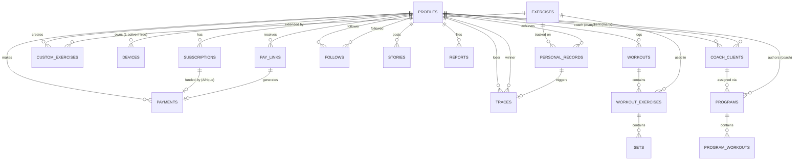

# DATA_MODEL.md — LYXO · Data Design
# Version : 1.0 — fin Juillet 2026
# Rôle : LE schéma de données faisant foi. Toute migration Prisma/SQL doit
# être cohérente avec ce document. Source de vérité en cas de divergence
# avec un extrait de code dans CLAUDE_LYXO_V3.md (qui contient des
# exemples pédagogiques, pas toujours le schéma final — règle §20.5).

---

## 1. ENTITY-RELATIONSHIP DIAGRAM



Cardinalités clés à retenir :
- **profiles ↔ coach_clients : many-to-many dans les DEUX sens** (Q20 —
  un user peut avoir plusieurs coachs, un coach peut être client d'un
  autre coach). `is_coach` est un booléen sur `profiles`, PAS un type de
  compte séparé.
- **follows : self-referencing many-to-many, ASYMÉTRIQUE** (Q6) — une
  ligne = une direction. Un follow "mutuel" = deux lignes existent (A→B
  ET B→A), calculé, jamais stocké comme tel.
- **subscriptions : 1 profile → N historique, mais 1 SEULE active/
  provisional_access à la fois** (contrainte d'unicité partielle).
- **personal_records → traces : 0 ou 1** — une Trace n'existe que si le
  PR dépassé appartenait à un follow MUTUEL (sinon pas de rivalité).

---

## 2. SCHÉMAS DE TABLES — types, contraintes, index

> Convention : toutes les tables synchronisées (celles listées "SYNC"
> ci-dessous) ont `id uuid`, `created_at`, `updated_at`, `deleted_at`
> (soft-delete obligatoire, §18.3). Les tables serveur-only (billing,
> reports) n'ont pas besoin de deleted_at synchronisé mais gardent
> created_at/updated_at par convention d'audit.

### 2.1 `profiles` [SYNC]
```sql
create table profiles (
  id uuid primary key references auth.users(id),
  username text unique not null,
  display_name text,
  avatar_initials text,              -- fallback LX si pas d'avatar custom
  bio text,
  country text,                       -- déclaré à l'onboarding
  language text not null default 'fr' check (language in ('fr','en')),
  weight_unit text not null default 'kg' check (weight_unit in ('kg','lbs')),
  goal text check (goal in ('force','masse','regularite')),
    -- choisi à l'onboarding PRÉ-auth (pattern IKEA, UI prompt écran 2),
    -- poussé via raw_user_meta_data au signup
  preferred_split text check (preferred_split in ('ppl','upper_lower','full_body','custom')),
    -- idem — pilote la rotation "Séance du jour" (smart default Accueil)
  weekly_goal int not null default 3 check (weekly_goal between 1 and 7),
    -- objectif hebdo de séances : défaut selon le split (ppl→3, upper_lower→4,
    -- full_body→3, custom→3), modifiable dans Paramètres. Alimente la
    -- week strip et le streak (PRD 1.3 — formules faisant foi)
  billing_region text not null default 'intl_iap'
    check (billing_region in ('africa_momo','intl_iap')),
  data_saver boolean not null default false,
  is_coach boolean not null default false,
  is_private boolean not null default false,
  is_reviewer boolean not null default false,   -- exclu des stats (SecOps)
  trial_used boolean not null default false,
  trial_expires_at timestamptz,
  hide_lost_titles boolean not null default false,   -- opt-out Trace
  rivalry_notifications boolean not null default true, -- opt-out Conquête
  private_sessions_default boolean not null default false,
  deleted_at timestamptz,
  created_at timestamptz not null default now(),
  updated_at timestamptz not null default now()
);
create index idx_profiles_username on profiles(username) where deleted_at is null;
create index idx_profiles_billing_region on profiles(billing_region);
```
RLS : lecture publique des profils NON privés ; profils privés visibles
seulement par soi-même + follows approuvés. Écriture : soi-même
uniquement (sauf billing_region, trial_*, is_reviewer — écrits par le
backend/admin uniquement, jamais par le client).

### 2.2 `devices` [SERVEUR]
```sql
create table devices (
  id uuid primary key default gen_random_uuid(),
  profile_id uuid not null references profiles(id),
  push_token text,
  last_active_at timestamptz not null default now(),
  is_active boolean not null default true,  -- 1 seul actif si gratuit (Q11b)
  created_at timestamptz not null default now()
);
create index idx_devices_profile_active on devices(profile_id) where is_active = true;
-- ⚠️ CORRECTION (audit doc) : PAS d'index UNIQUE partiel ici — un index
-- unique ne peut pas être "levé dynamiquement" et bloquerait physiquement
-- le multi-device des abonnés Lyxo+ (PRICING §5). La règle "1 appareil
-- actif si gratuit" est appliquée par la LOGIQUE APPLICATIVE au login
-- (invalidation de l'ancien device si statut premium dérivé = false),
-- couverte par un test d'intégration dédié (ROADMAP 3.6).
```

### 2.3 `exercises` [RÉFÉRENTIEL, lecture seule côté client]
```sql
create table exercises (
  id uuid primary key default gen_random_uuid(),
  external_id text unique,           -- ID ExerciseDB source
  name_fr text not null,
  name_en text not null,
  muscle_group text not null,
  equipment text,
  gif_url text,
  is_embedded_pack boolean not null default false,  -- les ~50 du pack de base
  created_at timestamptz not null default now()
);
create index idx_exercises_muscle_group on exercises(muscle_group);
```

### 2.4 `custom_exercises` [SYNC]
```sql
create table custom_exercises (
  id uuid primary key default gen_random_uuid(),
  profile_id uuid not null references profiles(id),
  name text not null,
  muscle_group text,
  deleted_at timestamptz,
  created_at timestamptz not null default now(),
  updated_at timestamptz not null default now()
);
-- Contrainte applicative (pas SQL) : max 5 par profile_id si gratuit
```

### 2.5 `workouts` [SYNC]
```sql
create table workouts (
  id uuid primary key default gen_random_uuid(),
  profile_id uuid not null references profiles(id),
  local_id text not null,             -- id généré client (offline)
  title text,
  program_id uuid,  -- nullable, si suivi d'un programme.
  -- ⚠️ SANS contrainte FK à la création (audit doc) : `programs` n'existe
  -- qu'en Phase 6, or `workouts` est créée en Phase 2 (ordre §4). La FK est
  -- ajoutée par la migration Phase 6 :
  --   ALTER TABLE workouts ADD CONSTRAINT fk_workouts_program
  --     FOREIGN KEY (program_id) REFERENCES programs(id);
  started_at timestamptz not null,
  completed_at timestamptz,
  total_volume_kg numeric,            -- calculé/caché à la complétion
  is_private boolean not null default false,
  deleted_at timestamptz,
  created_at timestamptz not null default now(),
  updated_at timestamptz not null default now()
);
create unique index uq_workout_local on workouts(profile_id, local_id);  -- idempotence sync
create index idx_workouts_profile_date on workouts(profile_id, started_at desc);
```

### 2.6 `workout_exercises` [SYNC]
```sql
create table workout_exercises (
  id uuid primary key default gen_random_uuid(),
  workout_id uuid not null references workouts(id),
  exercise_id uuid references exercises(id),
  custom_exercise_id uuid references custom_exercises(id),
  order_index int not null,
  deleted_at timestamptz,
  created_at timestamptz not null default now(),
  updated_at timestamptz not null default now(),
  check (exercise_id is not null or custom_exercise_id is not null)
);
create index idx_we_workout on workout_exercises(workout_id);
```

### 2.7 `sets` [SYNC]
```sql
create table sets (
  id uuid primary key default gen_random_uuid(),
  workout_exercise_id uuid not null references workout_exercises(id),
  set_number int not null,
  weight_kg numeric not null,         -- STOCKAGE CANONIQUE — §19.15, jamais lbs
  reps int not null,
  rpe numeric check (rpe between 1 and 10),  -- 1-10, jamais "100%" (SECURITY_NOTES §2.2)
  is_completed boolean not null default false,
  deleted_at timestamptz,
  created_at timestamptz not null default now(),
  updated_at timestamptz not null default now()
);
create index idx_sets_we on sets(workout_exercise_id);
```

### 2.8 `personal_records` [SYNC]
```sql
create table personal_records (
  id uuid primary key default gen_random_uuid(),
  profile_id uuid not null references profiles(id),
  exercise_id uuid not null references exercises(id),
  set_id uuid references sets(id),
  weight_kg numeric not null,
  reps int not null,
  estimated_1rm_kg numeric,
  pr_type text not null check (pr_type in ('weight','volume','reps','1rm')),
  is_social_eligible boolean not null default true,  -- anti-triche §18.1
  ineligibility_reason text,          -- 'implausible_weight' | 'delta_too_high' | 'insufficient_history'
  achieved_at timestamptz not null,
  deleted_at timestamptz,
  created_at timestamptz not null default now(),
  updated_at timestamptz not null default now()
);
create index idx_pr_profile_exercise on personal_records(profile_id, exercise_id);
-- Règle applicative (§18.1) : is_social_eligible = false si
--   weight_kg > 4 × body_weight OU delta > +15% vs précédent PR
--   OU < 3 séances loggées sur l'exercice
```

### 2.9 `follows` [SYNC]
```sql
create table follows (
  id uuid primary key default gen_random_uuid(),
  follower_id uuid not null references profiles(id),
  followed_id uuid not null references profiles(id),
  status text not null default 'active' check (status in ('pending','active')),
  -- 'pending' si followed_id.is_private = true, jusqu'à approbation
  deleted_at timestamptz,
  created_at timestamptz not null default now(),
  updated_at timestamptz not null default now(),  -- OBLIGATOIRE [SYNC] : le LWW et le pull incrémental comparent updated_at (audit doc)
  check (follower_id <> followed_id)
);
create unique index uq_follow on follows(follower_id, followed_id) where deleted_at is null;
create index idx_follows_followed on follows(followed_id);
-- "Mutuel" = calculé : exists both (A,B) and (B,A) avec status='active'
```

### 2.10 `stories` [SYNC]
```sql
create table stories (
  id uuid primary key default gen_random_uuid(),
  profile_id uuid not null references profiles(id),
  workout_id uuid references workouts(id),
  type text not null check (type in ('stat_card','photo_overlay')),
  photo_url text,                     -- null si stat_card
  stats_snapshot jsonb,               -- volume/durée/PRs au moment du partage
  expires_at timestamptz not null,    -- created_at + 24h
  created_at timestamptz not null default now()
);
create index idx_stories_profile_active on stories(profile_id) where expires_at > now();
-- Purge physique par cron à expiration (pas juste un filtre d'affichage)
```

### 2.11 `traces` [SERVEUR, dérivé]
```sql
create table traces (
  id uuid primary key default gen_random_uuid(),
  exercise_id uuid not null references exercises(id),
  loser_id uuid not null references profiles(id),    -- ancien détenteur
  winner_id uuid not null references profiles(id),   -- nouveau détenteur
  weight_kg numeric not null,
  achieved_at timestamptz not null,
  is_reclaimed boolean not null default false,
  archived_at timestamptz,             -- expire à 6 mois si non reclaimed (§18.2)
  created_at timestamptz not null default now()
);
create index idx_traces_loser on traces(loser_id) where archived_at is null;
```

### 2.12 `reports` [SERVEUR]
```sql
create table reports (
  id uuid primary key default gen_random_uuid(),
  reporter_id uuid not null references profiles(id),
  target_type text not null check (target_type in ('story','workout','profile')),
  target_id uuid not null,
  reason text,
  created_at timestamptz not null default now()
);
create index idx_reports_target on reports(target_type, target_id);
-- Auto-hide applicatif à 3 signalements distincts sur le même target
```

### 2.13 `coach_clients` [SYNC] — many-to-many, Q20
```sql
create table coach_clients (
  id uuid primary key default gen_random_uuid(),
  coach_id uuid not null references profiles(id),
  client_id uuid not null references profiles(id),
  invite_code text,
  accepted_at timestamptz,
  deleted_at timestamptz,
  created_at timestamptz not null default now(),
  check (coach_id <> client_id)
);
create unique index uq_coach_client on coach_clients(coach_id, client_id) where deleted_at is null;
create index idx_cc_client on coach_clients(client_id);
-- Limite applicative Coach Découverte : 3 clients actifs max (PRICING §5)
```

### 2.14 `programs` [SYNC]
```sql
create table programs (
  id uuid primary key default gen_random_uuid(),
  coach_id uuid not null references profiles(id),
  name text not null,
  cycle_weeks int,                    -- libre, défini par le coach (Q18)
  is_for_sale boolean not null default false,   -- V2 uniquement, false en V1
  price_fcfa int,                     -- V2
  deleted_at timestamptz,
  created_at timestamptz not null default now(),
  updated_at timestamptz not null default now()
);
```

### 2.15 `program_workouts` [SYNC]
```sql
create table program_workouts (
  id uuid primary key default gen_random_uuid(),
  program_id uuid not null references programs(id),
  week_number int not null,
  day_label text,
  exercise_id uuid references exercises(id),
  target_sets int,
  target_reps int,
  target_weight_kg numeric,           -- OU target_percent_1rm, au choix coach
  target_percent_1rm numeric,
  deleted_at timestamptz,
  created_at timestamptz not null default now(),
  updated_at timestamptz not null default now()  -- OBLIGATOIRE [SYNC] (audit doc)
);
```

### 2.16 `subscriptions` [SERVEUR — ROADMAP Phase 9 uniquement (= Phase produit 3), §20.6]
```sql
create table subscriptions (
  id uuid primary key default gen_random_uuid(),
  profile_id uuid not null references profiles(id),
  source text not null check (source in ('pawapay','revenuecat')),
  plan text not null check (plan in ('monthly','annual')),
  status text not null check (status in
    ('pending','provisional_access','active','expired','failed','refunded','canceled')),
  current_period_start timestamptz,
  current_period_end timestamptz,
  external_ref text,                  -- deposit_id PawaPay OU app_user_id RevenueCat
  deleted_at timestamptz,
  created_at timestamptz not null default now(),
  updated_at timestamptz not null default now()
);
create unique index one_active_sub on subscriptions(profile_id)
  where status in ('active','provisional_access') and deleted_at is null;
```

### 2.17 `payments` [SERVEUR — ROADMAP Phase 9, voie Afrique]
```sql
create table payments (
  id uuid primary key default gen_random_uuid(),
  profile_id uuid not null references profiles(id),
  subscription_id uuid references subscriptions(id),
  provider text not null default 'pawapay',
  amount int not null,                -- FCFA entiers
  currency text not null default 'XAF',
  status text not null check (status in
    ('pending','provisional_access','complete','failed','refunded')),
  deposit_id uuid unique,             -- idempotence PawaPay native
  pay_token text,
  created_at timestamptz not null default now(),
  completed_at timestamptz
);
```

### 2.18 `pay_links` [SERVEUR — ROADMAP Phase 9]
```sql
create table pay_links (
  token text primary key,
  profile_id uuid not null references profiles(id),
  plan text not null check (plan in ('monthly','annual')),
  expires_at timestamptz not null,    -- +7 jours
  used_at timestamptz,
  created_at timestamptz not null default now()
);
create index idx_pay_links_profile on pay_links(profile_id) where used_at is null;
```

### 2.19 `feature_flags` [SERVEUR — kill switch maison, DoD 8]
```sql
create table feature_flags (
  key text primary key,
  enabled boolean not null default true,
  updated_at timestamptz not null default now()
);
-- Lu par l'app au payload de sync — jamais un SDK tiers (SaaS écarté).
-- ⚠️ Les flags CRITIQUES (sync_enabled, billing_enabled) sont AUSSI
-- exposés via GET /v1/flags (sans auth, appelé au boot — API_SPEC §4.6) :
-- un kill switch ne peut pas dépendre du canal qu'il est censé couper.
```

---

## 3. RELATIONSHIPS & CARDINALITY — résumé

| Relation | Cardinalité | Note |
|---|---|---|
| profiles → workouts | 1 → N | |
| workouts → workout_exercises → sets | 1 → N → N | Cascade logique, pas de cascade DELETE physique (soft-delete) |
| profiles ↔ follows | N ↔ N (asymétrique, self-ref) | Mutuel = calculé, pas stocké |
| profiles ↔ coach_clients | N ↔ N (double sens) | is_coach = attribut, pas un type |
| personal_records → traces | 1 → 0..1 | Seulement si follow mutuel concerné |
| programs → program_workouts | 1 → N | |
| coach_clients → programs (assignation) | via table de jointure implicite (program_id sur workouts, ou table séparée `program_assignments` si V2 exige plus de traçabilité) |
| profiles → subscriptions | 1 → N (historique), 1 active max | Contrainte d'unicité partielle |
| pay_links → payments | 1 → 0..1 | Le lien génère au plus un paiement réussi (used_at) |

---

## 4. MIGRATION / VERSIONING APPROACH

- **Source de vérité : migrations SQL manuelles** dans `supabase/migrations/`
  (règle §19.9/§20.5) — jamais l'interface web Supabase, jamais Prisma en
  premier.
- Nommage : `YYYYMMDDHHMMSS_description_courte.sql` (format Supabase CLI
  standard, généré par `supabase migration new <nom>`).
- Après CHAQUE migration appliquée : `npm run supabase:generate-types` →
  régénère `src/types/supabase.ts` ET déclenche `prisma db pull` pour
  aligner `schema.prisma` — jamais l'inverse (Prisma ne doit jamais être
  la source qui invente une colonne).
- Aucune migration ne fait de `DROP COLUMN`/`DROP TABLE` destructif en
  production sans un export de sauvegarde préalable documenté dans le
  message de commit.
- Toutes les tables listées "SYNC" ci-dessus DOIVENT avoir `deleted_at`
  dès leur création — l'ajouter après coup casse le protocole
  WatermelonDB déjà en place (leçon de la correction §18.3).
- Ordre de création respecté strictement selon le Bloc A2 de
  IMPLEMENTATION_PLAN : profiles/devices/exercises d'abord (rien ne les
  référence en amont), puis workouts/sets (⚠️ workouts.program_id SANS FK
  à ce stade — la FK vers programs est ajoutée en Phase 6, voir §2.5),
  puis social, puis coach, puis billing (ROADMAP Phase 9 uniquement —
  aucune table `subscriptions/payments/pay_links` créée avant, §20.6).
- ⚠️ Discover public (Phase 8) : les tables `posts`/`comments` ne sont PAS
  encore spécifiées ici — c'est VOLONTAIRE. À spécifier dans ce document
  au début de la Phase 8, jamais improvisées en session.

---

*Documents liés : ARCHITECTURE.md (vue système) · BILLING_FLOW.md (détail
du flux et des états billing) · CLAUDE_LYXO_V3.md §18-20 (règles
d'origine de chaque contrainte) · IMPLEMENTATION_PLAN.md Bloc A2 (ordre
d'exécution des migrations).*
