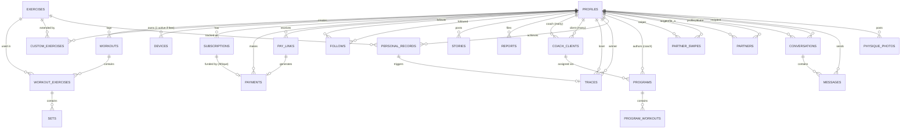

# DATA_MODEL.md — LYXO · Data Design
# Version : 1.0 — fin Juillet 2026
# Rôle : LE schéma de données faisant foi. Toute migration Prisma/SQL doit
# être cohérente avec ce document. Source de vérité en cas de divergence
# avec un extrait de code dans CLAUDE_LYXO_V3.md (qui contient des
# exemples pédagogiques, pas toujours le schéma final — règle §20.5).

---

## 1. ENTITY-RELATIONSHIP DIAGRAM


```mermaid
erDiagram
    PROFILES ||--o{ WORKOUTS : "logs"
    PROFILES ||--o{ CUSTOM_EXERCISES : "creates"
    PROFILES ||--o{ DEVICES : "owns (1 active if free)"
    PROFILES ||--o{ SUBSCRIPTIONS : "has"
    PROFILES ||--o{ PAYMENTS : "makes"
    PROFILES ||--o{ PAY_LINKS : "receives"
    PROFILES ||--o{ FOLLOWS : "follower"
    PROFILES ||--o{ FOLLOWS : "followed"
    PROFILES ||--o{ STORIES : "posts"
    PROFILES ||--o{ REPORTS : "files"
    PROFILES ||--o{ COACH_CLIENTS : "coach (many)"
    PROFILES ||--o{ COACH_CLIENTS : "client (many)"
    PROFILES ||--o{ TRACES : "loser"
    PROFILES ||--o{ TRACES : "winner"

    WORKOUTS ||--o{ WORKOUT_EXERCISES : "contains"
    WORKOUT_EXERCISES ||--o{ SETS : "contains"
    EXERCISES ||--o{ WORKOUT_EXERCISES : "used in"
    EXERCISES ||--o{ CUSTOM_EXERCISES : "extended by"
    EXERCISES ||--o{ PERSONAL_RECORDS : "tracked on"

    PROFILES ||--o{ PERSONAL_RECORDS : "achieves"
    PERSONAL_RECORDS ||--o| TRACES : "triggers"

    COACH_CLIENTS ||--o{ PROGRAMS : "assigned via"
    PROFILES ||--o{ PROGRAMS : "authors (coach)"
    PROGRAMS ||--o{ PROGRAM_WORKOUTS : "contains"

    SUBSCRIPTIONS ||--o| PAYMENTS : "funded by (Afrique)"
    PAY_LINKS ||--o| PAYMENTS : "generates"

    PROFILES ||--o{ PARTNER_SWIPES : "swiper"
    PROFILES ||--o{ PARTNER_SWIPES : "target"
    PROFILES ||--o{ PARTNERS : "profile_a"
    PROFILES ||--o{ PARTNERS : "profile_b"
    PROFILES ||--o{ CONVERSATIONS : "initiator"
    PROFILES ||--o{ CONVERSATIONS : "recipient"
    CONVERSATIONS ||--o{ MESSAGES : "contains"
    PROFILES ||--o{ MESSAGES : "sends"
    PROFILES ||--o{ PHYSIQUE_PHOTOS : "posts"
```

Cardinalités clés à retenir :
- **profiles ↔ coach_clients : many-to-many dans les DEUX sens** (Q20 —
  un user peut avoir plusieurs coachs, un coach peut être client d'un
  autre coach). `is_coach` est un booléen sur `profiles`, PAS un type de
  compte séparé.
- **follows : self-referencing many-to-many, ASYMÉTRIQUE** (Q6) — une
  ligne = une direction. Un follow "mutuel" = deux lignes existent (A→B
  ET B→A), calculé, jamais stocké comme tel.
- **subscriptions : 1 profile → N historique, mais 1 SEULE active/
  provisional_access à la fois** (contrainte d'unicité partielle).
- **personal_records → traces : 0 ou 1** — une Trace n'existe que si le
  PR dépassé appartenait à un follow MUTUEL (sinon pas de rivalité).
- **profiles ↔ partner_swipes : self-referencing, ASYMÉTRIQUE, apparaît
  DEUX FOIS dans le diagramme** (audit doc #19) — une fois en tant que
  `swiper` (qui swipe), une fois en tant que `target` (qui est swipé),
  exactement comme `follows` §2.9. Match mutuel (`partners`) = calculé
  depuis deux lignes `partner_swipes` opposées, jamais stocké tel quel.
- **profiles ↔ partners : N ↔ N calculé**, self-referencing également
  (`profile_a`/`profile_b`) — relation distincte de `follows`.
- **profiles ↔ conversations : self-referencing** (`initiator`/
  `recipient`) — une conversation existe indépendamment d'un match
  `partners` ; son `status` (`pending`/`accepted`) dérive de l'existence
  d'un match au moment de l'envoi (§2.22).

---

## 2. SCHÉMAS DE TABLES — types, contraintes, index

> Convention : toutes les tables synchronisées (celles listées "SYNC"
> ci-dessous) ont `id uuid`, `created_at`, `updated_at`, `deleted_at`
> (soft-delete obligatoire, §18.3). Les tables serveur-only (billing,
> reports) n'ont pas besoin de deleted_at synchronisé mais gardent
> created_at/updated_at par convention d'audit.
>
> ⚠️ Génération de `id` (audit doc #22) : pour TOUTE table [SYNC], `id`
> est TOUJOURS généré CÔTÉ CLIENT (WatermelonDB) au moment de l'insertion
> locale, puis renvoyé tel quel au push — c'est ce qui rend le push
> idempotent (rejouer le même push est un no-op, API_SPEC §4.1). Le
> `default gen_random_uuid()` visible sur chaque colonne `id` ci-dessous
> ne sert QUE pour les inserts serveur directs (scripts admin, cron,
> seed) — jamais emprunté sur le chemin `/v1/sync/push`.
>
> ⚠️ RLS = defense-in-depth, pas le mécanisme primaire (audit doc #6) :
> le backend interroge Postgres avec la clé `service_role`, qui
> CONTOURNE les policies RLS par défaut. Les policies RLS documentées
> table par table ci-dessous sont une protection secondaire (utile si un
> accès direct à Postgres existait un jour) — l'autorisation réelle est
> vérifiée dans le code du backend (middlewares + services), voir
> ARCHITECTURE.md §2.

### 2.1 `profiles` [SYNC]
```sql
create table profiles (
  id uuid primary key references auth.users(id),
  username text unique not null,
  display_name text,
  avatar_initials text,              -- fallback LX si pas d'avatar custom
  bio text,
  country text,                       -- déclaré à l'onboarding
  language text not null default 'fr' check (language in ('fr','en')),
  weight_unit text not null default 'kg' check (weight_unit in ('kg','lbs')),
  goal text check (goal in ('force','masse','regularite')),
    -- choisi à l'onboarding PRÉ-auth (pattern IKEA, UI prompt écran 2),
    -- poussé via raw_user_meta_data au signup
  preferred_split text check (preferred_split in ('ppl','upper_lower','full_body','custom')),
    -- idem — pilote la rotation "Séance du jour" (smart default Accueil)
  weekly_goal int not null default 3 check (weekly_goal between 1 and 7),
    -- objectif hebdo de séances : défaut selon le split (ppl→3, upper_lower→4,
    -- full_body→3, custom→3), modifiable dans Paramètres. Alimente la
    -- week strip et le streak (PRD 1.3 — formules faisant foi)
  billing_region text not null default 'intl_iap'
    check (billing_region in ('africa_momo','intl_iap')),
  data_saver boolean not null default false,
  is_coach boolean not null default false,
  is_private boolean not null default false,
  is_reviewer boolean not null default false,   -- exclu des stats (SecOps)
  trial_used boolean not null default false,
  trial_expires_at timestamptz,
  hide_lost_titles boolean not null default false,   -- opt-out Trace
  rivalry_notifications boolean not null default true, -- opt-out Conquête
  private_sessions_default boolean not null default false,
  deleted_at timestamptz,
  created_at timestamptz not null default now(),
  updated_at timestamptz not null default now()
);
create index idx_profiles_username on profiles(username) where deleted_at is null;
create index idx_profiles_billing_region on profiles(billing_region);
```
RLS : lecture publique des profils NON privés ; profils privés visibles
seulement par soi-même + follows approuvés. Écriture : soi-même
uniquement (sauf billing_region, trial_*, is_reviewer — écrits par le
backend/admin uniquement, jamais par le client).

### 2.2 `devices` [SERVEUR]
```sql
create table devices (
  id uuid primary key default gen_random_uuid(),
  profile_id uuid not null references profiles(id),
  device_id text not null,            -- AJOUTÉ 2026-07-31 (ROADMAP 3.6) : identité
                                       -- stable de l'appareil, générée client
                                       -- (SecureStore), pas un second uuid serveur
  push_token text,
  last_active_at timestamptz not null default now(),
  is_active boolean not null default true,  -- 1 seul actif si gratuit (Q11b)
  created_at timestamptz not null default now()
);
create index idx_devices_profile_active on devices(profile_id) where is_active = true;
create unique index uq_device_profile_device on devices(profile_id, device_id);  -- identité, pas activité — voir note ci-dessous
-- ⚠️ CORRECTION (audit doc) : PAS d'index UNIQUE partiel ici — un index
-- unique ne peut pas être "levé dynamiquement" et bloquerait physiquement
-- le multi-device des abonnés Lyxo+ (PRICING §5). La règle "1 appareil
-- actif si gratuit" est appliquée par la LOGIQUE APPLICATIVE au login
-- (invalidation de l'ancien device si statut premium dérivé = false),
-- couverte par un test d'intégration dédié (ROADMAP 3.6).
-- `uq_device_profile_device` ci-dessus n'est PAS ce type d'index : il porte
-- sur l'IDENTITÉ (profile_id, device_id), jamais sur `is_active` — aucun
-- conflit avec la correction précédente, aucune restriction sur le nombre
-- d'appareils actifs simultanés qu'il autorise.
```

### 2.3 `exercises` [RÉFÉRENTIEL, lecture seule côté client — PULL-ABLE]
```sql
create table exercises (
  id uuid primary key default gen_random_uuid(),
  external_id text unique,           -- ID free-exercise-db source (bascule ExerciseDB Pro prévue, cf. ARCHITECTURE.md §3)
  name_fr text not null,
  name_en text not null,
  muscle_group text not null,
  equipment text,
  gif_url text,
  is_embedded_pack boolean not null default false,  -- les ~50 du pack de base
  created_at timestamptz not null default now(),
  updated_at timestamptz not null default now()  -- AJOUTÉ (audit doc #4) : rend la table
    -- compatible avec le protocole GET /v1/sync/pull (comparaison incrémentale
    -- sur `since`), indispensable pour pousser une mise à jour du catalogue
    -- (ex. bascule ExerciseDB Pro) sans redéploiement app. Voir API_SPEC.md §4.1.
);
create index idx_exercises_muscle_group on exercises(muscle_group);
```

### 2.4 `custom_exercises` [SYNC]
```sql
create table custom_exercises (
  id uuid primary key default gen_random_uuid(),
  profile_id uuid not null references profiles(id),
  name text not null,
  muscle_group text,
  deleted_at timestamptz,
  created_at timestamptz not null default now(),
  updated_at timestamptz not null default now()
);
-- Max 5 par profile_id si gratuit. ⚠️ CORRECTION (ROADMAP 2.2) : la règle
-- était documentée comme "applicative (pas SQL)" par parallèle avec devices
-- (§2.2), mais le raisonnement ne tient pas ici — ce qui est écarté sur
-- devices c'est un index UNIQUE, non levable dynamiquement. Un TRIGGER l'est,
-- lui : `enforce_custom_exercise_limit()` interroge `has_active_premium()` à
-- chaque insert. Posée en base parce que le client écrit en direct via RLS
-- (limite côté app seule = contournable avec la clé anon), et parce qu'un
-- trigger s'applique aussi aux écritures service_role du backend — qui
-- bypassent RLS mais pas les triggers, donc couvre le push de sync (Phase 3).
-- Les lignes soft-deleted ne comptent pas ; une restauration (deleted_at
-- repassé à NULL) reconsomme un emplacement.
```
RLS (audit doc #23, defense-in-depth) : lecture/écriture réservées à
`profile_id = auth.uid()` — jamais visible par un tiers, même en
follow (exercices custom = perso, pas sociaux).

### 2.5 `workouts` [SYNC]
```sql
create table workouts (
  id uuid primary key default gen_random_uuid(),
  profile_id uuid not null references profiles(id),
  local_id text not null,             -- id généré client (offline)
  title text,
  program_id uuid,  -- nullable, si suivi d'un programme.
  -- ⚠️ SANS contrainte FK à la création (audit doc) : `programs` n'existe
  -- qu'en Phase 6, or `workouts` est créée en Phase 2 (ordre §4). La FK est
  -- ajoutée par la migration Phase 6 :
  --   ALTER TABLE workouts ADD CONSTRAINT fk_workouts_program
  --     FOREIGN KEY (program_id) REFERENCES programs(id);
  started_at timestamptz not null,
  completed_at timestamptz,
  total_volume_kg numeric,            -- calculé/caché à la complétion
  is_private boolean not null default false,
  deleted_at timestamptz,
  created_at timestamptz not null default now(),
  updated_at timestamptz not null default now()
);
create unique index uq_workout_local on workouts(profile_id, local_id);  -- idempotence sync
create index idx_workouts_profile_date on workouts(profile_id, started_at desc);
```
RLS (audit doc #23, defense-in-depth) : écriture réservée à
`profile_id = auth.uid()`. Lecture : soi-même toujours ; les autres
uniquement si `is_private = false` ET (profil public OU follow
actif) — jamais de lecture d'un workout `is_private = true` par un
tiers, quel que soit le statut de follow (cohérent avec l'exclusion
`is_private` du feed, API_SPEC §4.3).

### 2.6 `workout_exercises` [SYNC]
```sql
create table workout_exercises (
  id uuid primary key default gen_random_uuid(),
  workout_id uuid not null references workouts(id),
  local_id text not null,             -- id généré client (offline) — AJOUTÉ
                                       -- 2026-07-31, gap ROADMAP 3.3 : oublié
                                       -- ici alors que workouts l'avait déjà
  exercise_id uuid references exercises(id),
  custom_exercise_id uuid references custom_exercises(id),
  order_index int not null,
  deleted_at timestamptz,
  created_at timestamptz not null default now(),
  updated_at timestamptz not null default now(),
  check (exercise_id is not null or custom_exercise_id is not null)
);
create index idx_we_workout on workout_exercises(workout_id);
create unique index uq_workout_exercise_local on workout_exercises(workout_id, local_id);  -- idempotence sync, scopé au parent (pas de profile_id direct ici)
```
RLS (audit doc #23, defense-in-depth — voir note §2 en tête) : hérite de
la visibilité du `workout` parent (jointure sur `workout_id`) — lecture
alignée sur `workouts.is_private`/follows mutuels, écriture réservée au
propriétaire (`workouts.profile_id = auth.uid()`).

### 2.7 `sets` [SYNC]
```sql
create table sets (
  id uuid primary key default gen_random_uuid(),
  workout_exercise_id uuid not null references workout_exercises(id),
  local_id text not null,             -- id généré client (offline) — AJOUTÉ
                                       -- 2026-07-31, même gap ROADMAP 3.3
  set_number int not null,
  weight_kg numeric not null,         -- STOCKAGE CANONIQUE — §19.15, jamais lbs
  reps int not null,
  rpe numeric check (rpe between 1 and 10),  -- 1-10, jamais "100%" (SECURITY_NOTES §2.2)
  is_completed boolean not null default false,
  deleted_at timestamptz,
  created_at timestamptz not null default now(),
  updated_at timestamptz not null default now()
);
create index idx_sets_we on sets(workout_exercise_id);
create unique index uq_set_local on sets(workout_exercise_id, local_id);  -- idempotence sync, scopé au parent
```
RLS (audit doc #23, defense-in-depth) : hérite de la visibilité du
`workout` ancêtre (jointure `workout_exercise_id` → `workout_id`) —
mêmes règles que `workout_exercises` ci-dessus.

### 2.8 `personal_records` [SYNC]
```sql
create table personal_records (
  id uuid primary key default gen_random_uuid(),
  local_id text not null,             -- id généré client (offline) — AJOUTÉ
                                       -- 2026-07-31, même gap ROADMAP 3.3
  profile_id uuid not null references profiles(id),
  exercise_id uuid not null references exercises(id),
  set_id uuid references sets(id),
  weight_kg numeric not null,
  reps int not null,
  estimated_1rm_kg numeric,
  pr_type text not null check (pr_type in ('weight','volume','reps','1rm')),
  is_social_eligible boolean not null default true,  -- anti-triche §18.1
  ineligibility_reason text,          -- 'implausible_weight' | 'delta_too_high' | 'insufficient_history'
  achieved_at timestamptz not null,
  deleted_at timestamptz,
  created_at timestamptz not null default now(),
  updated_at timestamptz not null default now()
);
create index idx_pr_profile_exercise on personal_records(profile_id, exercise_id);
create unique index uq_personal_record_local on personal_records(profile_id, local_id);  -- idempotence sync
-- Règle applicative (§18.1) : is_social_eligible = false si
--   weight_kg > 4 × body_weight OU delta > +15% vs précédent PR
--   OU < 3 séances loggées sur l'exercice
```
⚠️ **Manque un index sur `set_id`** (trouvé le 2026-07-31, pas encore
corrigé) : c'est une FK sans index — Postgres n'indexe jamais
automatiquement une clé étrangère. Ralentit les jointures et élargit les
verrous pris lors d'un `delete`/soft-delete côté `sets`. Volume faible
aujourd'hui (table vide), pas urgent, mais à ajouter (`create index
idx_pr_set on personal_records(set_id)`) au prochain passage sur cette
table plutôt que d'attendre un signal de lenteur.
RLS (audit doc #23, defense-in-depth) : écriture réservée à
`profile_id = auth.uid()`. Lecture : soi-même toujours ; pour les
tiers (leaderboard), uniquement les lignes `is_social_eligible = true`
d'un profil public ou en follow mutuel (même filtre applicatif que
`GET /v1/leaderboard/:exercise_id`, API_SPEC §4.3).

### 2.9 `follows` [SYNC]
```sql
create table follows (
  id uuid primary key default gen_random_uuid(),
  follower_id uuid not null references profiles(id),
  followed_id uuid not null references profiles(id),
  status text not null default 'active' check (status in ('pending','active')),
  -- 'pending' si followed_id.is_private = true, jusqu'à approbation
  deleted_at timestamptz,
  created_at timestamptz not null default now(),
  updated_at timestamptz not null default now(),  -- OBLIGATOIRE [SYNC] : le LWW et le pull incrémental comparent updated_at (audit doc)
  check (follower_id <> followed_id)
);
create unique index uq_follow on follows(follower_id, followed_id) where deleted_at is null;
create index idx_follows_followed on follows(followed_id);
-- "Mutuel" = calculé : exists both (A,B) and (B,A) avec status='active'
```

### 2.10 `stories` [ÉPHÉMÈRE, PAS [SYNC] — voir justification ci-dessous]
> ⚠️ CORRECTION (audit doc #2) : `stories` était étiquetée [SYNC] par
> erreur. Elle n'a JAMAIS été synchronisée offline-first via le
> protocole WatermelonDB (pas de `local_id`, pas de champ dans le
> payload `sync/pull` de §4.1 API_SPEC, pas de model WatermelonDB
> prévu en LLD.md `db/models/`) — son contenu est éphémère (24h) et
> purement serveur : postée directement via `POST /v1/stories`, jamais
> composée offline puis rejouée. La purge PHYSIQUE par cron ci-dessous
> est donc légitime et volontaire : la règle "soft-delete obligatoire
> (§18.3)" protège l'intégrité du protocole de sync, elle ne s'applique
> qu'aux tables réellement [SYNC] — `stories` n'en fait pas partie, donc
> un vrai `DELETE` à expiration n'est PAS une violation de cette règle.
```sql
create table stories (
  id uuid primary key default gen_random_uuid(),
  profile_id uuid not null references profiles(id),
  workout_id uuid references workouts(id),
  type text not null check (type in ('stat_card','photo_overlay')),
  photo_url text,                     -- null si stat_card
  stats_snapshot jsonb,               -- volume/durée/PRs au moment du partage
  expires_at timestamptz not null,    -- created_at + 24h
  created_at timestamptz not null default now()
);
create index idx_stories_profile_active on stories(profile_id);
-- ⚠️ CORRECTION (audit doc #5) : PAS de prédicat `where expires_at > now()`
-- sur cet index — `now()` n'est pas IMMUTABLE en PostgreSQL, un index
-- partiel ne peut pas être défini dessus (erreur à la création). Le
-- filtrage de fraîcheur (`expires_at > now()`) se fait CÔTÉ REQUÊTE
-- applicative (clause WHERE de la query, pas dans la définition de
-- l'index) — l'index reste utile pour l'accès par profile_id.
-- Purge physique par cron à expiration (pas juste un filtre d'affichage
-- — légitime ici, voir justification [ÉPHÉMÈRE, PAS SYNC] ci-dessus).
```
RLS (audit doc #23, defense-in-depth) : lecture réservée à soi-même +
follows actifs (mêmes règles de visibilité que le feed) tant que non
expirée ; écriture réservée à `profile_id = auth.uid()`.

### 2.11 `traces` [SERVEUR, dérivé]
```sql
create table traces (
  id uuid primary key default gen_random_uuid(),
  exercise_id uuid not null references exercises(id),
  loser_id uuid not null references profiles(id),    -- ancien détenteur
  winner_id uuid not null references profiles(id),   -- nouveau détenteur
  weight_kg numeric not null,
  achieved_at timestamptz not null,
  is_reclaimed boolean not null default false,
  archived_at timestamptz,             -- expire à 6 mois si non reclaimed (§18.2)
  created_at timestamptz not null default now()
);
create index idx_traces_loser on traces(loser_id) where archived_at is null;
```

### 2.12 `reports` [SERVEUR]
```sql
create table reports (
  id uuid primary key default gen_random_uuid(),
  reporter_id uuid not null references profiles(id),
  target_type text not null check (target_type in ('story','workout','profile')),
  target_id uuid not null,
  reason text,
  created_at timestamptz not null default now()
);
create index idx_reports_target on reports(target_type, target_id);
-- Auto-hide applicatif à 3 signalements distincts sur le même target
```

### 2.13 `coach_clients` [SYNC] — many-to-many, Q20
```sql
create table coach_clients (
  id uuid primary key default gen_random_uuid(),
  coach_id uuid not null references profiles(id),
  client_id uuid not null references profiles(id),
  invite_code text,
  accepted_at timestamptz,
  deleted_at timestamptz,
  created_at timestamptz not null default now(),
  updated_at timestamptz not null default now(),  -- AJOUTÉ (audit doc #1) : manquant, OBLIGATOIRE [SYNC]
  check (coach_id <> client_id)
);
create unique index uq_coach_client on coach_clients(coach_id, client_id) where deleted_at is null;
create index idx_cc_client on coach_clients(client_id);
-- Limite applicative Coach Découverte : 3 clients actifs max (PRICING §5)
```
RLS (audit doc #23, defense-in-depth) : lecture/écriture réservées aux
deux parties de la relation (`coach_id = auth.uid()` OU
`client_id = auth.uid()`) — relation dyadique, jamais visible d'un
tiers.

### 2.14 `programs` [SYNC]
```sql
create table programs (
  id uuid primary key default gen_random_uuid(),
  coach_id uuid not null references profiles(id),
  name text not null,
  cycle_weeks int,                    -- libre, défini par le coach (Q18)
  is_for_sale boolean not null default false,   -- V2 uniquement, false en V1
  price_fcfa int,                     -- V2
  deleted_at timestamptz,
  created_at timestamptz not null default now(),
  updated_at timestamptz not null default now()
);
```
RLS (audit doc #23, defense-in-depth) : lecture réservée au coach
auteur (`coach_id = auth.uid()`) + aux clients qui lui sont assignés
via `coach_clients` ; écriture réservée à `coach_id = auth.uid()`.

### 2.15 `program_workouts` [SYNC]
```sql
create table program_workouts (
  id uuid primary key default gen_random_uuid(),
  program_id uuid not null references programs(id),
  week_number int not null,
  day_label text,
  exercise_id uuid references exercises(id),
  target_sets int,
  target_reps int,
  target_weight_kg numeric,           -- OU target_percent_1rm, au choix coach
  target_percent_1rm numeric,
  deleted_at timestamptz,
  created_at timestamptz not null default now(),
  updated_at timestamptz not null default now()  -- OBLIGATOIRE [SYNC] (audit doc)
);
```
RLS (audit doc #23, defense-in-depth) : hérite de la visibilité du
`program` parent (jointure sur `program_id`) — mêmes règles que
`programs` ci-dessus.

### 2.16 `subscriptions` [SERVEUR — ROADMAP Phase 9 uniquement (= Phase produit 3), §20.6]
```sql
create table subscriptions (
  id uuid primary key default gen_random_uuid(),
  profile_id uuid not null references profiles(id),
  source text not null check (source in ('pawapay','revenuecat')),
  plan text not null check (plan in ('monthly','annual')),
  status text not null check (status in
    ('pending','provisional_access','active','expired','failed','refunded','canceled')),
  current_period_start timestamptz,
  current_period_end timestamptz,
  external_ref text,                  -- deposit_id PawaPay OU app_user_id RevenueCat
  deleted_at timestamptz,
  created_at timestamptz not null default now(),
  updated_at timestamptz not null default now()
);
create unique index one_active_sub on subscriptions(profile_id)
  where status in ('active','provisional_access') and deleted_at is null;
```

### 2.17 `payments` [SERVEUR — ROADMAP Phase 9, voie Afrique]
```sql
create table payments (
  id uuid primary key default gen_random_uuid(),
  profile_id uuid not null references profiles(id),
  subscription_id uuid references subscriptions(id),
  provider text not null default 'pawapay',
  amount int not null,                -- FCFA entiers
  currency text not null default 'XAF',
  status text not null check (status in
    ('pending','provisional_access','complete','failed','refunded')),
  deposit_id uuid unique,             -- idempotence PawaPay native
  pay_token text,
  created_at timestamptz not null default now(),
  completed_at timestamptz
);
```

### 2.18 `pay_links` [SERVEUR — ROADMAP Phase 9]
```sql
create table pay_links (
  token text primary key,
  profile_id uuid not null references profiles(id),
  plan text not null check (plan in ('monthly','annual')),
  expires_at timestamptz not null,    -- +7 jours
  used_at timestamptz,
  created_at timestamptz not null default now()
);
create index idx_pay_links_profile on pay_links(profile_id) where used_at is null;
```

### 2.19 `feature_flags` [SERVEUR — kill switch maison, DoD 8]
```sql
create table feature_flags (
  key text primary key,
  enabled boolean not null default true,
  updated_at timestamptz not null default now()
);
-- Lu par l'app au payload de sync — jamais un SDK tiers (SaaS écarté).
-- ⚠️ Les flags CRITIQUES (sync_enabled, billing_enabled) sont AUSSI
-- exposés via GET /v1/flags (sans auth, appelé au boot — API_SPEC §4.6) :
-- un kill switch ne peut pas dépendre du canal qu'il est censé couper.
```

### 2.20 `partner_swipes` [SYNC] — Gym Matching, override V1 daté 2026-07-24
```sql
-- ⚠️ Override d'un non-goal (CLAUDE_LYXO_V3.md §18 / PROJECT_BRIEF.md
-- non-goal 3) — voir LLD.md §6.8 / ROADMAP.md Phase 5bis pour la trace.
create table partner_swipes (
  id uuid primary key default gen_random_uuid(),
  swiper_id uuid not null references profiles(id),
  target_id uuid not null references profiles(id),
  direction text not null check (direction in ('like','reject')),
  deleted_at timestamptz,             -- AJOUTÉ (audit doc #1) : manquant, OBLIGATOIRE [SYNC]
  created_at timestamptz not null default now(),
  updated_at timestamptz not null default now(),  -- AJOUTÉ (audit doc #1) : manquant, OBLIGATOIRE [SYNC]
  check (swiper_id <> target_id)
);
create unique index uq_partner_swipe on partner_swipes(swiper_id, target_id) where deleted_at is null;
-- Match mutuel = exists both (A,B) et (B,A) avec direction='like' → crée
-- une ligne `partners` (calculé, pas stocké deux fois, même logique que
-- "mutuel" sur follows §2.9)
```
RLS (audit doc #23, defense-in-depth) : lecture/écriture réservées à
`swiper_id = auth.uid()` — un profil ne voit jamais les swipes dont il
est la cible (anti-manipulation du matching).

### 2.21 `partners` [SYNC] — Gym Matching, relation distincte de `follows`
```sql
create table partners (
  id uuid primary key default gen_random_uuid(),
  profile_a_id uuid not null references profiles(id),
  profile_b_id uuid not null references profiles(id),
  matched_at timestamptz not null default now(),
  deleted_at timestamptz,
  updated_at timestamptz not null default now(),  -- AJOUTÉ (audit doc #1) : manquant, OBLIGATOIRE [SYNC]
  check (profile_a_id <> profile_b_id),
  check (profile_a_id < profile_b_id)  -- paire canonique, évite les doublons A-B/B-A
);
create unique index uq_partners_pair on partners(profile_a_id, profile_b_id) where deleted_at is null;
```
RLS (audit doc #23, defense-in-depth) : lecture/écriture réservées aux
deux profils du match (`profile_a_id = auth.uid()` OU
`profile_b_id = auth.uid()`).

### 2.22 `conversations` + `messages` [SYNC] — chat Partners, override V1
```sql
-- Porte le dossier "Requests" (LLD.md §6.8) : status='pending' tant que le
-- destinataire n'a pas explicitement accepté un message venant d'un
-- non-Partner ; toujours 'accepted' d'emblée entre Partners matchés.
create table conversations (
  id uuid primary key default gen_random_uuid(),
  initiator_id uuid not null references profiles(id),
  recipient_id uuid not null references profiles(id),
  status text not null default 'accepted' check (status in ('pending','accepted')),
  -- 'pending' si initiator/recipient ne sont pas Partners au moment de l'envoi
  deleted_at timestamptz,             -- AJOUTÉ (audit doc #1) : manquant, OBLIGATOIRE [SYNC]
  created_at timestamptz not null default now(),
  updated_at timestamptz not null default now(),
  check (initiator_id <> recipient_id)
);
create unique index uq_conversation_pair on conversations(least(initiator_id, recipient_id), greatest(initiator_id, recipient_id)) where deleted_at is null;

create table messages (
  id uuid primary key default gen_random_uuid(),
  conversation_id uuid not null references conversations(id),
  sender_id uuid not null references profiles(id),
  body text not null,
  deleted_at timestamptz,
  created_at timestamptz not null default now(),
  updated_at timestamptz not null default now()
);
create index idx_messages_conversation on messages(conversation_id, created_at);
```
RLS (audit doc #23, defense-in-depth) : `conversations` — lecture/
écriture réservées aux deux parties (`initiator_id = auth.uid()` OU
`recipient_id = auth.uid()`). `messages` — lecture/écriture réservées
aux membres de la `conversation_id` correspondante (jointure sur
`conversations`), écriture d'un nouveau message en plus soumise à
`sender_id = auth.uid()`.

### 2.23 `physique_photos` [SYNC] — menu Actions › Physique, photos uniquement
```sql
-- Pas de chiffres ici (poids/masse grasse/taille restent des stat cards
-- dans Performance, LLD.md §6.5) — galerie de progression pure.
create table physique_photos (
  id uuid primary key default gen_random_uuid(),
  profile_id uuid not null references profiles(id),
  photo_url text not null,
  taken_at timestamptz not null default now(),
  deleted_at timestamptz,
  created_at timestamptz not null default now(),
  updated_at timestamptz not null default now()
);
create index idx_physique_photos_profile on physique_photos(profile_id) where deleted_at is null;
```
RLS (audit doc #23, defense-in-depth) : lecture/écriture réservées à
`profile_id = auth.uid()` — toujours privé par défaut, aucune option
de partage public (pas de champ `is_private` ici : c'est la valeur par
défaut et unique, contrairement à `workouts`/`profiles`).

⚠️ **AJOUT (audit technique 2026-07-25) — politique de stockage
`photo_url` non négociable** : `physique_photos` est la donnée la plus
sensible du schéma (photos corporelles) — la règle générique "Supabase
Storage, URL signée" (ARCHITECTURE.md §2, composant Storage) doit
s'appliquer ici de façon STRICTE, plus stricte que pour `stories` :
- Bucket Supabase Storage **privé** (pas de lecture publique anonyme
  possible même en devinant le chemin).
- `photo_url` stocké en base = le CHEMIN objet dans le bucket, jamais une
  URL signée pré-générée (elle expirerait) — l'API génère une URL signée
  à la demande, **TTL court (5-15 min)**, à chaque lecture
  (`GET /v1/physique-photos` retourne des URLs fraîches, pas celle de
  l'upload).
- Jamais d'URL permanente ni de cache CDN public sur ce bucket.
- ⚠️ CORRECTION : un bucket privé + TTL court ne protège que le
  *stockage*. C'est l'acte de **signer** qui accorde l'accès — signer un
  chemin fourni par le client reviendrait à transformer l'API en oracle
  de déchiffrement du bucket (envoyer le chemin d'autrui → recevoir une
  URL valide). Contrat obligatoire, à CHAQUE signature, sans exception :
  1. **Autorisation par la ligne, jamais par le chemin.** Le serveur part
     d'un `physique_photos.id`, charge la ligne, vérifie
     `profile_id = auth.uid()` et `deleted_at is null`, et ne signe que
     le `photo_url` lu DANS cette ligne. Un chemin transmis par le client
     n'est jamais signé, même s'il "a l'air" correct.
  2. **Chemin déterministe et lié au profil** :
     `physique/{profile_id}/{photo_id}.{ext}`, `profile_id` et `photo_id`
     générés serveur. À l'upload comme à la lecture, le serveur revérifie
     que le segment `{profile_id}` du chemin égale `auth.uid()` — un
     rejet dur, pas une normalisation silencieuse (défense en profondeur
     si une ligne était corrompue).
  3. Aucune traversée possible : chemin validé contre cette forme exacte
     (UUID/UUID), pas par filtrage de `..`.
  Ces photos n'ont **aucun mode de partage** en V1 : il n'existe pas de
  cas légitime où `profile_id != auth.uid()` produit une signature.

### 2.24 `admin_audit_log` [SERVEUR] — AJOUTÉ (audit technique 2026-07-25)
```sql
-- Traçabilité des actions admin (`X-Admin-Key`, API_SPEC.md §1) — sans
-- cette table, un accès admin (clé fuitée ou usage légitime) est
-- indétectable a posteriori. Écriture obligatoire à CHAQUE route
-- /v1/admin/* qui modifie une donnée (correction billing_region, review
-- de signalement, action de support) — pas sur les lectures simples.
create table admin_audit_log (
  id uuid primary key default gen_random_uuid(),
  action text not null,               -- ex. 'billing_region_correction', 'report_reviewed'
  -- ON DELETE SET NULL : sans ça, la purge d'un compte à J+30 (§18.5)
  -- se heurte à cette FK — soit la purge échoue (obligation RGPD non
  -- tenue), soit on supprime les lignes d'audit avec le profil, ce qui
  -- efface précisément la trace des actions admin sur ce compte. Le
  -- journal doit survivre au profil qu'il documente.
  target_profile_id uuid references profiles(id) on delete set null,
  -- L'identifiant purgé reste lisible ici (ex. { "target_profile_id":
  -- "<uuid>" }) : écrit à CHAQUE entrée, il conserve la traçabilité même
  -- après le passage à NULL de la colonne ci-dessus. C'est un
  -- identifiant technique, pas une donnée personnelle réidentifiante
  -- une fois le profil purgé.
  details jsonb,                       -- avant/après ou contexte (jamais de secret dedans)
  created_at timestamptz not null default now()
);
create index idx_admin_audit_target on admin_audit_log(target_profile_id);
```
Pas de RLS (table serveur pure, jamais exposée à un client) — écrite
uniquement par le middleware admin (`middlewares/` backend), lue
uniquement via un accès direct DB (pas de route de consultation en V1,
pas de besoin avant qu'un volume d'actions admin le justifie).

---

## 3. RELATIONSHIPS & CARDINALITY — résumé

| Relation | Cardinalité | Note |
|---|---|---|
| profiles → workouts | 1 → N | |
| workouts → workout_exercises → sets | 1 → N → N | Cascade logique, pas de cascade DELETE physique (soft-delete) |
| profiles ↔ follows | N ↔ N (asymétrique, self-ref) | Mutuel = calculé, pas stocké |
| profiles ↔ coach_clients | N ↔ N (double sens) | is_coach = attribut, pas un type |
| personal_records → traces | 1 → 0..1 | Seulement si follow mutuel concerné |
| programs → program_workouts | 1 → N | |
| coach_clients → programs (assignation) | via table de jointure implicite (program_id sur workouts, ou table séparée `program_assignments` si V2 exige plus de traçabilité) |
| profiles → subscriptions | 1 → N (historique), 1 active max | Contrainte d'unicité partielle |
| pay_links → payments | 1 → 0..1 | Le lien génère au plus un paiement réussi (used_at) |
| profiles ↔ partner_swipes | N ↔ N (asymétrique, self-ref, DEUX rôles : swiper + target) | Même logique que follows §2.9 — apparaît deux fois dans le diagramme ER §1 |
| profiles ↔ partners | N ↔ N (calculé depuis partner_swipes) | Distinct de follows — Gym Matching, override V1 |
| partners → conversations | pas de FK directe | Conversation existe indépendamment ; son `status` dérive de l'existence d'un match `partners` au moment de l'envoi |
| profiles ↔ conversations | N ↔ N (self-ref, DEUX rôles : initiator + recipient) | |
| conversations → messages | 1 → N | |
| profiles → physique_photos | 1 → N | Galerie de progression, toujours privée (§2.23) |

---

## 4. MIGRATION / VERSIONING APPROACH

- **Source de vérité : migrations SQL manuelles** dans `supabase/migrations/`
  (règle §19.9/§20.5) — jamais l'interface web Supabase, jamais Prisma en
  premier.
- Nommage : `YYYYMMDDHHMMSS_description_courte.sql` (format Supabase CLI
  standard, généré par `supabase migration new <nom>`).
- Après CHAQUE migration appliquée : `npm run supabase:generate-types` →
  régénère `src/types/supabase.ts` ET déclenche `prisma db pull` pour
  aligner `schema.prisma` — jamais l'inverse (Prisma ne doit jamais être
  la source qui invente une colonne).
- Aucune migration ne fait de `DROP COLUMN`/`DROP TABLE` destructif en
  production sans un export de sauvegarde préalable documenté dans le
  message de commit.
- Toutes les tables listées "SYNC" ci-dessus DOIVENT avoir `deleted_at`
  dès leur création — l'ajouter après coup casse le protocole
  WatermelonDB déjà en place (leçon de la correction §18.3).
- Ordre de création respecté strictement selon le Bloc A2 de
  IMPLEMENTATION_PLAN : profiles/devices/exercises d'abord (rien ne les
  référence en amont), puis workouts/sets (⚠️ workouts.program_id SANS FK
  à ce stade — la FK vers programs est ajoutée en Phase 6, voir §2.5),
  puis social, puis coach, puis billing (ROADMAP Phase 9 uniquement —
  aucune table `subscriptions/payments/pay_links` créée avant, §20.6).
- ⚠️ Discover public (Phase 8) : les tables `posts`/`comments` ne sont PAS
  encore spécifiées ici — c'est VOLONTAIRE. À spécifier dans ce document
  au début de la Phase 8, jamais improvisées en session.

---

## 4bis. SAUVEGARDE & REPRISE APRÈS SINISTRE (AJOUTÉ, audit technique 2026-07-25)

> Rôle : jusqu'ici, la seule mention de sauvegarde était "export documenté
> dans le message de commit avant un DROP destructif" (§4) — insuffisant
> pour le critère de succès n°1 du produit ("zéro perte de donnée
> signalée", PROJECT_BRIEF.md §3). Cette section devient la référence.

- **PITR (Point-In-Time Recovery)** : activer le plan Supabase incluant
  le PITR (disponible à partir du plan Pro) AVANT la Phase 7 (beta 10
  coachs — c'est le moment où de vraies données existent et deviennent
  irremplaçables). Rétention cible : au minimum 7 jours glissants.
- **RPO/RTO cibles** (à formaliser, valeurs de départ raisonnables pour
  un solo dev) : RPO ≤ 24h (perte maximale acceptable en cas de
  restauration), RTO ≤ 4h (délai de restauration acceptable) — à revoir
  à la hausse dès que le volume d'utilisateurs actifs le justifie.
- **Test de restauration réel obligatoire avant Phase 7** : un exercice
  de restauration purement théorique ne compte pas — restaurer une
  branche Supabase de test à partir d'un point dans le passé et vérifier
  l'intégrité des données restaurées, une fois, avant que des données
  beta réelles existent. Documenter la date et le résultat ici.
- **Migrations destructives** (`DROP COLUMN`/`DROP TABLE`) : la règle
  existante (export documenté en commit) reste, mais s'ajoute au filet
  PITR — elle ne le remplace pas.
- Statut actuel : ⬜ non fait — action à réaliser avant Phase 7
  (IMPLEMENTATION_PLAN.md), à cocher ici une fois le test de restauration
  effectué.

---

*Documents liés : ARCHITECTURE.md (vue système) · BILLING_FLOW.md (détail
du flux et des états billing) · CLAUDE_LYXO_V3.md §18-20 (règles
d'origine de chaque contrainte) · IMPLEMENTATION_PLAN.md Bloc A2 (ordre
d'exécution des migrations).*
